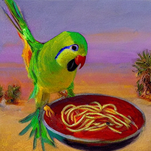
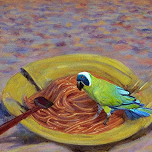
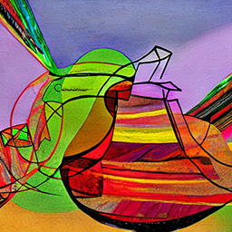
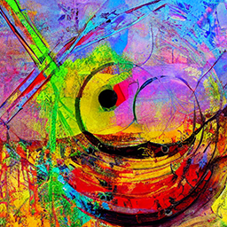

# Stable Diffusion in Docker

Runs the official [Stable Diffusion](https://huggingface.co/CompVis/stable-diffusion)
release on [Huggingface](https://huggingface.co/) in a GPU accelerated Docker
container.

```sh
./build.sh run 'An impressionist painting of a parakeet eating spaghetti in the desert'
```




```sh
./build.sh run --image parakeet_eating_spaghetti.png --strength 0.6 'Abstract art'
```




## Before you start

By default, the pipeline uses the full model and weights which requires a CUDA
capable GPU with 8GB+ of VRAM. It should take a few seconds to create one image.
On less powerful GPUs you may need to modify some of the options; see the
[Examples](#examples) section for more details. If you lack a suitable GPU you
can set the option `--device cpu` instead. If you are using Docker Desktop and
the container is terminated you may need to give Docker more resources by
increasing the CPU, memory, and swap in the Settings -> Resources section.

Since it uses the official model, you will need to create a [user access token](https://huggingface.co/docs/hub/security-tokens)
in your [Huggingface account](https://huggingface.co/settings/tokens). Save the
user access token in a file called `token.txt` and make sure it is available
when building the container.

## Quickstart

The pipeline is managed using a single [`build.sh`](build.sh) script. You must
build the image before it can be run.

## Build

Make sure your [user access token](#before-you-start) is saved in a file called
`token.txt`. The token content should begin with `hf_...`

To build:

```sh
./build.sh build  # or just ./build.sh
```

## Run

### Text-to-Image

To run:

```sh
./build.sh run 'Andromeda galaxy in a bottle'
```

### Image-to-Image

First, copy an image to the `input` folder. Next, to run:

```sh
./build.sh run --image image.png 'Andromeda galaxy in a bottle'
```

### Diffusion Inpainting

First, copy an image and an image mask to the `input` folder. White areas of the
mask will be diffused and black areas will be kept untouched. Next, to run:

```sh
./build.sh run --model 'runwayml/stable-diffusion-inpainting' \
  --image image.png --mask mask.png 'Andromeda galaxy in a bottle'
```

### Options

Some of the options from [`txt2img.py`](https://github.com/CompVis/stable-diffusion/blob/main/scripts/txt2img.py)
are implemented for compatibility:

* `--prompt [PROMPT]`: the prompt to render into an image
* `--n_samples [N_SAMPLES]`: number of images to create per run (default 1)
* `--n_iter [N_ITER]`: number of times to run pipeline (default 1)
* `--H [H]`: image height in pixels (default 512, must be divisible by 64)
* `--W [W]`: image width in pixels (default 512, must be divisible by 64)
* `--scale [SCALE]`: unconditional guidance scale (default 7.5)
* `--seed [SEED]`: RNG seed for repeatability (default is a random seed)
* `--ddim_steps [DDIM_STEPS]`: number of sampling steps (default 50)

Other options:

* `--attention-slicing`: use less memory at the expense of inference speed
(default is no attention slicing)
* `--device [DEVICE]`: the cpu or cuda device to use to render images (default
`cuda`)
* `--half`: use float16 tensors instead of float32 (default `float32`)
* `--image [IMAGE]`: the input image to use for image-to-image diffusion
(default `None`)
* `--mask [MASK]`: the input mask to use for diffusion inpainting (default
`None`)
* `--model [MODEL]`: the model used to render images (default is
`CompVis/stable-diffusion-v1-4`)
* `--negative-prompt [NEGATIVE_PROMPT]`: the prompt to not render into an image
(default `None`)
* `--skip`: skip safety checker (default is the safety checker is on)
* `--strength [STRENGTH]`: diffusion strength to apply to the input image
(default 0.75)
* `--token [TOKEN]`: specify a Huggingface user access token at the command line
instead of reading it from a file (default is a file)

## Examples

These commands are both identical:

```sh
./build.sh run 'abstract art'
./build.sh run --prompt 'abstract art'
```

Set the seed to 42:

```sh
./build.sh run --seed 42 'abstract art'
```

Options can be combined:

```sh
./build.sh run --scale 7.0 --seed 42 'abstract art'
```

On systems with <8GB of GPU RAM, you can try mixing and matching options:

* Make images smaller than 512x512 using `--W` and `--H` to decrease memory use
and increase image creation speed
* Use `--half` to decrease memory use but slightly decrease image quality
* Use `--attention-slicing` to decrease memory use but also decrease image
creation speed
* Decrease the number of samples and increase the number of iterations with
`--n_samples` and `--n_iter` to decrease overall memory use
* Skip the safety checker with `--skip` to run less code

```sh
./build.sh run --W 256 --H 256 --half --attention-slicing --skip --prompt 'abstract art'
```

On Windows, if you aren't using WSL2 and instead use MSYS, MinGW, or Git Bash,
prefix your commands with `MSYS_NO_PATHCONV=1` (or export it beforehand):

```sh
MSYS_NO_PATHCONV=1 ./build.sh run --half --prompt 'abstract art'
```

## Outputs

### Model

The model and other files are cached in a volume called `huggingface`. The
models are stored in `<volume>/diffusers/<model>/snapshots/<githash>/unet/<weights>`.
Checkpoint files (`ckpt`s) are unofficial versions of the official models, and
so these are not part of the official release.

### Images

The images are saved as PNGs in the `output` folder using the prompt text. The
`build.sh` script creates and mounts this folder as a volume in the container.
